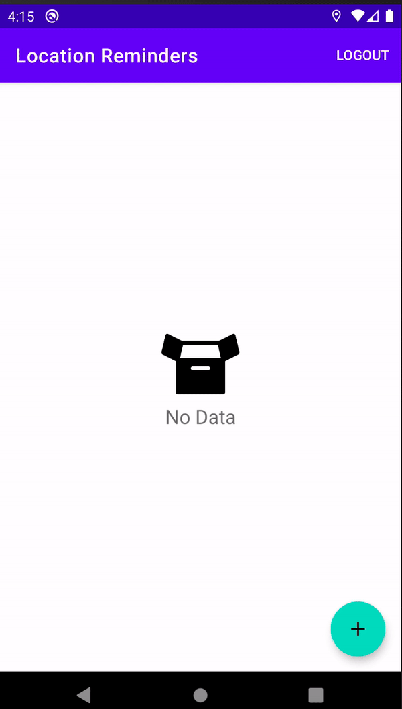

# Location Reminder App

Third project of the [Android Kotlin Developer Nanodegree course](https://www.udacity.com/course/android-kotlin-developer-nanodegree--nd940), create custom views, use motion layout and push notificiations.

## Getting Started

Download the project from [Github](https://github.com/RicardoBravoA/LocationReminder), the updated branch is **master**

### Dependencies

This project uses the following dependencies

- [ConstraintLayout](https://developer.android.com/training/constraint-layout)
- [Navigation Components](https://developer.android.com/guide/navigation/navigation-getting-started)
- [Room](https://developer.android.com/topic/libraries/architecture/room)
- [Retrofit](https://square.github.io/retrofit/)
- [Moshi](https://github.com/square/moshi)


### Installation

For now it has 2 environments.

```
debug
release
```

## Testing

- Execute ./gradlew assembleDebugAndroidTest
- Execute ./gradlew assembleDebugUnitTest

## Project Instructions

The project has this features.

<p align="center">
  <br>
</p>

- Main
    - Load a list of elements
    - Allows to save a point of interest
    - Select a point of interest on the map
    - Shows a notification when you enter a point of interest
- Detail
    - Shows the status of the notification pressed

## License

    Copyright 2020 Ricardo Bravo (Woz).

    Licensed under the Apache License, Version 2.0 (the "License");
    you may not use this file except in compliance with the License.
    You may obtain a copy of the License at

       http://www.apache.org/licenses/LICENSE-2.0

    Unless required by applicable law or agreed to in writing, software
    distributed under the License is distributed on an "AS IS" BASIS,
    WITHOUT WARRANTIES OR CONDITIONS OF ANY KIND, either express or implied.
    See the License for the specific language governing permissions and
    limitations under the License.